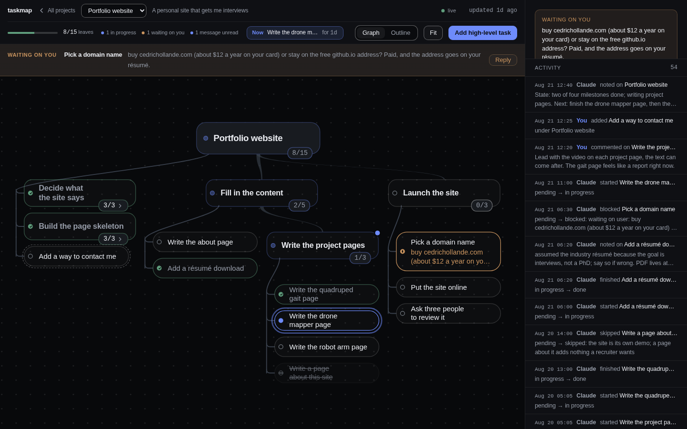
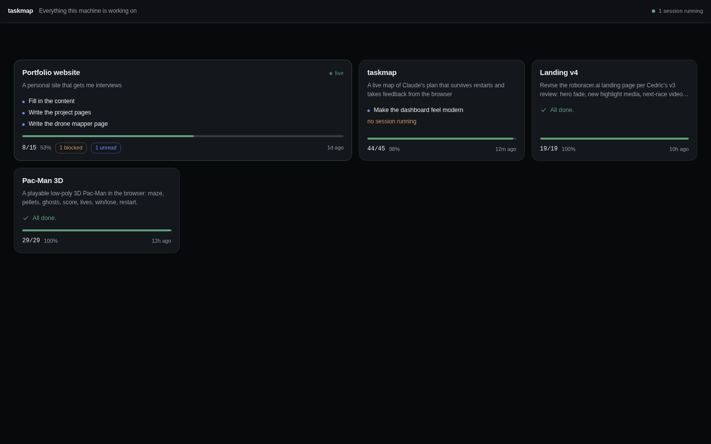

# taskmap

Claude Code is good at long runs and bad at showing you one. `taskmap` gives it a plan
you can watch: a tree of plain-language tasks with live status, open in a browser at
**http://localhost:4242**, that you can comment on while it works. Your comment reaches
the running session as a notification. The map is also Claude's own memory of the plan,
so it survives compaction and restarts.



No dependencies, no account, no network. Node 20 or newer. The server binds
`127.0.0.1` only, unless you deliberately share it to a phone.

## Install

```bash
git clone https://github.com/cedrichld/taskmap ~/.claude/skills/taskmap
ln -s ~/.claude/skills/taskmap/bin/taskmap ~/.local/bin/taskmap   # for your own shell
```

Restart Claude Code, then:

```bash
taskmap demo
```

That opens a finished sample project so you can see what the dashboard does before
trusting it with real work. The second line above is only for your own terminal —
Claude Code puts a plugin's `bin/` on the Bash tool's `PATH` by itself.

Two optional lines make it smoother. In `~/.claude/settings.json`, so Claude never has
to ask before touching the map:

```json
{ "permissions": { "allow": ["Bash(taskmap *)"] } }
```

And in `~/.claude/CLAUDE.md`, so it reaches for the map without being told:

```markdown
For any task that will take more than a few minutes or touch more than a couple of
files, invoke /taskmap before writing code and keep the map current while you work.
```

`~/.claude/skills/taskmap/` is a
[skills-directory plugin](https://code.claude.com/docs/en/plugins-reference#skills-directory-plugins):
Claude Code discovers it in place as `taskmap@skills-dir` on the next start, in every
project, with no install step. Confirm with `claude plugin list`; `/taskmap` should
appear in the `/` menu and `taskmap-inbox` in `/tasks`.

## How it behaves

You do not drive it. For any task that takes more than a few minutes Claude runs
`taskmap status`, creates a map if there is none, writes the plan in one batch, and
keeps statuses current as it goes. It prints the dashboard URL once. Type `/taskmap`
to invoke it by hand.

The plan is written for a reader who does not know the stack. Every node has a short
verb-first title; milestones and non-obvious leaves add one observable check that says
they are done — "the maze from the sketch is visible and the player cannot cross a
wall", not "tests pass". Longer text is reserved for nodes where Claude is thinking a
problem through. Taskmap commands ride along in the same shell call as the real work,
so the map costs a few percent of a session, not a fifth of it.

Three levels below the root: milestones, chunks, steps. One leaf in progress at a
time. Work Claude discovers becomes a node before it is done, dead ends become
skipped nodes with a reason, and assumptions are written on the node rather than
turned into a question. Claude blocks and asks only when the decision costs money,
destroys data, is public, or would change the rest of the plan.

## One tab, every project

`http://localhost:4242/` is an overview: one card per project with its goal,
progress, what is in progress right now, blocked and unread counts, and a green dot
for every project a Claude Code session is actually running in. Live projects sort
first. Click a card to open that project's map at `/p/<id>`.



This is the tab to leave open on a second monitor. Claude opens it for you once per
session and never again — if you close it, it stays closed until you open it or the
project changes.

## Talking back

The dashboard is not read-only. On any node you can:

- **Send a message** (Ctrl/Cmd+Enter in the panel). The running session gets
  `[taskmap] feedback on n12 "…": …` within a second, as a notification — no need to
  interrupt what Claude is typing. It reads the full text with `taskmap inbox`,
  acknowledges on the node, and adjusts.
- **Add a task**, at the top level or under any node. It shows up with a dashed ring;
  Claude fills in the detail when it reaches it.
- **Answer a blocked question.** Blocked nodes are listed in a **Waiting on you** strip
  under the header. **Reply** puts the cursor in the right box.
- **Override a status**: mark done, mark blocked, reopen.

Unread messages stay highlighted until Claude has actually read them.

The graph pans and zooms (`f` fits it to the window); **Outline** is the same tree as a
list; the activity feed on the right shows every change with who made it.

## Share to your phone

```bash
taskmap share          # prints a link and a QR code
taskmap share --stop   # ends it
```

`share` opens a [Cloudflare quick tunnel](https://developers.cloudflare.com/cloudflare-one/connections/connect-networks/do-more-with-tunnels/trycloudflare/)
— no account, a random `trycloudflare.com` address — and prints the link with a QR
code drawn in the terminal. Point a phone camera at it. Under 768 px the map opens as
an outline, tapping a task raises a sheet with the message box one tap away, and the
overview cards stack. `cloudflared` has to be installed; `share` tells you where to
get it if it is not.

**The security part, because it matters.** The dashboard can put text into a running
Claude Code session, so a public address without a lock would hand that to anyone who
guessed it: `share` mints a 32-byte random token, and while a share is running every
request that does not come from this machine must carry it — first in the link, then
in an `HttpOnly` cookie the server sets — and everything else gets a bare 401. The
token lives in `~/.taskmap/share.json`; `--stop` deletes it, which kills every link
that was ever handed out. Requests from your own machine are never asked for it.

## The CLI

Claude uses this; you can too.

```
taskmap init "<name>" --goal "<one sentence>" [--track]
taskmap add "<title>" --parent <id> [--what ..] [--done-when ..] [--why ..] [--link <id>].. [--after <id>]
taskmap add --batch < items.json            # [{key, parent, title, what?, done_when?, why?, links?}]
taskmap start <id> [--note ".."]            # also starts its pending parents
taskmap done <id> [--note ".."] [--next] [--state ".."]
                                            # closes parents whose leaves are all done; --next starts the next
                                            # leaf and prints it; --state notes where things stand on n0
taskmap block|skip <id> --reason ".." | reopen <id> [--note ".."]
taskmap edit <id> --title|--what|--why|--done-when|--parent|--order|--link|--unlink ..
taskmap note <id> "<text>"
taskmap tree [--open|--all] [--depth N]     # --open collapses finished subtrees
taskmap show <id> | next | inbox [--peek] | status | check [--json]
taskmap serve [--ensure|--stop|--restart|--foreground] [--port N]
taskmap open [--if-needed] | watch | demo | forget <project id>
taskmap share [--stop|--restart]            # public link + QR through a cloudflared tunnel
taskmap export --obsidian <dir>             # one note per node, [[wikilinks]] between them
taskmap config prompt-reminder on|off
```

Tree glyphs: `[ ]` pending, `[~]` in progress, `[x]` done, `[!]` blocked, `[-]` skipped,
`*` user-added, `(2 unread)` unread feedback. Progress counts leaves only, and skipped
leaves are excluded from the total.

`taskmap forget <id>` drops a project from the dashboard switcher without touching its
files. `--project <id>` (or `TASKMAP_PROJECT=<id>`) targets a registered project from
anywhere. `taskmap help` prints the rest.

## Where state lives

| Path | Contents |
| --- | --- |
| `<project>/.taskmap/map.json` | The map. Every write is atomic and serialized through a lock file. |
| `<project>/.taskmap/log.jsonl` | Every change, one JSON line each. |
| `<project>/.taskmap/inbox.jsonl` | The subset you originated. |
| `~/.taskmap/registry.json` | Every project the dashboard knows about. |
| `~/.taskmap/server.pid`, `server.log` | The one shared server. |
| `~/.taskmap/config.json` | Small preferences. |
| `~/.taskmap/sessions/` | One heartbeat file per running session; what the live dot reads. |
| `~/.taskmap/share.json` | The share token. Exists only while `taskmap share` is running. |
| `~/.taskmap/demo/` | The demo project. |

`taskmap init` adds `.taskmap/` to the project's `.gitignore` unless you pass `--track`.
Nothing leaves your machine.

One server serves every project. It starts on demand and outlives the session;
`taskmap serve --stop` ends it, `--restart` reloads it after editing `src/` or `ui/`,
and `TASKMAP_PORT` moves it off 4242 (export it for Claude Code too, or its hook will
still look at 4242).

## Uninstall

```bash
taskmap serve --stop
rm -rf ~/.claude/skills/taskmap ~/.taskmap ~/.local/bin/taskmap
```

Then drop `"Bash(taskmap *)"` from `~/.claude/settings.json`, the taskmap paragraph
from `~/.claude/CLAUDE.md`, and any `<project>/.taskmap/` directories you no longer
want. They are gitignored, so `git status` will not remind you.

## Development

```bash
bash tests/smoke.sh          # temp project, isolated home, its own port
claude plugin validate .     # manifest and hook schema
node tests/gen40.js <dir>    # a 40-node map for layout checks
python3 tests/qr-verify.py   # decodes src/qr.js output with OpenCV (skips if absent)
node tests/shots.js <projectId|/path> 1440x900 out.png [select=n10] [view=outline] [mobile=1]
scripts/install-skills.sh <checkout>   # third-party design skills, not tracked here
```

- Data model, CLI output and HTTP API: [docs/SPEC.md](docs/SPEC.md)
- Visual language: [docs/design/DESIGN.md](docs/design/DESIGN.md)

MIT licensed. Issues and pull requests welcome.
