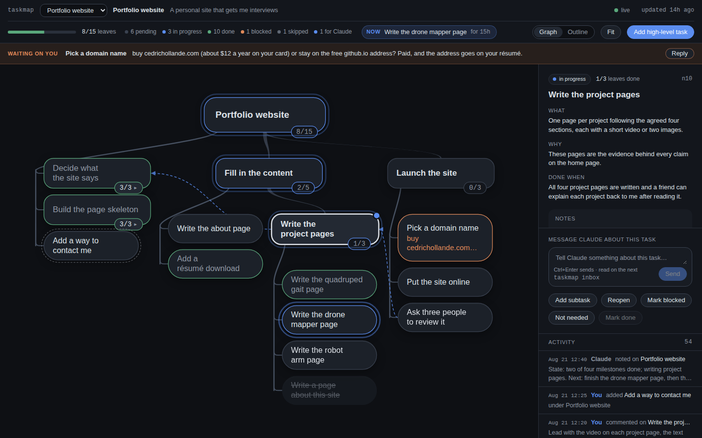

# taskmap

A live task map for long Claude Code runs. While Claude works, it keeps its plan as a
tree of plain-language nodes (milestones, chunks, steps) with live status. You open
**http://localhost:4242**, see the whole plan, leave feedback on any node, and add
tasks from the browser; those reach the running session as notifications. The map is
also Claude's own durable plan: it survives compaction and restarts.



The design language (bubbles, rings, layout, motion, tokens) is in
[docs/design/DESIGN.md](docs/design/DESIGN.md).

Zero runtime dependencies. Node >= 20. Single user, local only (the server binds
`127.0.0.1`, never `0.0.0.0`).

## How it is installed

This folder, `~/.claude/skills/taskmap/`, is a Claude Code
[skills-directory plugin](https://code.claude.com/docs/en/plugins-reference#skills-directory-plugins):
Claude Code loads it as `taskmap@skills-dir` in every project, with no install step.
It provides:

| Piece | What it does |
| --- | --- |
| `SKILL.md` | The skill. `/taskmap` (also `/taskmap:taskmap`). Claude invokes it on its own for multi-step work. |
| `bin/taskmap` | The CLI. On Claude's Bash `PATH` while the plugin is enabled; symlinked to `~/.local/bin/taskmap` for your shell. |
| `hooks/hooks.json` | `SessionStart`: starts the server if needed and prints a one-line map summary into Claude's context; after a compaction (`source: compact`) it prints the whole `tree --open` instead, so the plan survives. `Stop`: blocks the end of a turn once while a leaf is still in progress (respects `stop_hook_active`). `UserPromptSubmit`: an optional one-line reminder for prompts over 400 characters when nothing is in progress — off by default, `taskmap config prompt-reminder on` enables it. |
| `monitors/monitors.json` | `taskmap-inbox`: a background `taskmap watch` that turns dashboard feedback into `[taskmap] …` notifications inside the session. |

Outside the repo, the build also added `"Bash(taskmap *)"` to `permissions.allow` in
`~/.claude/settings.json` and a short `## taskmap` block to `~/.claude/CLAUDE.md`.

**After a restart, confirm it loaded:** `claude plugin list` shows `taskmap@skills-dir`
under "Skills-directory plugins", `/taskmap` appears in the `/` menu, and the task
panel (`/tasks`) lists the `taskmap-inbox` monitor. Edits to `SKILL.md` are picked up
live; edits to `hooks/` or `monitors/` need `/reload-plugins` or a restart.

## Using it from a Claude session

Nothing to do: for any task that takes more than a few minutes Claude runs
`taskmap status`, creates the map if needed, plans with one `add --batch`, and keeps
statuses current. Type `/taskmap` to invoke it explicitly. Open the URL it prints
(or run `taskmap open`) and watch.

From the dashboard you can:

- **Send feedback** on any node (Ctrl/Cmd+Enter). Claude sees
  `[taskmap] feedback on n12 "…": …` immediately and reads it with `taskmap inbox`.
- **Add a high-level task** (header button) or **Add subtask** (side panel). They get
  a dashed outer ring (`*` in the CLI tree); Claude decomposes them when it reaches them.
- **Answer a blocked question**: the **Waiting on you** strip under the header lists
  every blocked node with its question; **Reply** opens the message box on that node.
- **Override a status**: Mark done, Mark blocked, Reopen. Logged as actor `ui`.
- Switch between **Graph** (pan, zoom, `f` to fit, click a count pill or double-click
  to fold a branch) and **Outline**, and read the **activity feed**. The **Now** chip
  names the leaf Claude is working on.

Unread feedback stays highlighted until Claude runs `taskmap inbox`.

## Using the CLI yourself

The `taskmap status`, `taskmap check` and session-start lines include a `blocked: n`
count; `taskmap check` also prints one `waiting:` line per blocked node.

```
taskmap init "<name>" --goal "<one sentence>" [--track]
taskmap add "<title>" --parent <id> [--what ..] [--why ..] [--done-when ..] [--link <id>].. [--after <id>]
taskmap add --batch < items.json            # [{key, parent, title, what, why, done_when, links}]
taskmap start|done|block|skip|reopen <id>   # done --note ".."; block/skip --reason ".."
taskmap edit <id> --title|--what|--why|--done-when|--parent|--order|--link|--unlink ..
taskmap note <id> "<text>"
taskmap tree [--open|--all] [--depth N]     # --open collapses finished subtrees
taskmap show <id> | next | inbox [--peek] | status | check [--json]
taskmap serve [--ensure|--stop|--restart|--foreground] [--port N]
taskmap open | watch | demo | forget <project id>
taskmap export --obsidian <dir>             # one note per node, [[wikilinks]] to parent/children/dependencies
taskmap config prompt-reminder on|off       # the UserPromptSubmit nudge; stored in ~/.taskmap/config.json
```

`taskmap forget <id>` drops a project from the dashboard switcher (its files are untouched).

`taskmap demo` builds the sample "Portfolio website" project at `~/.taskmap/demo/` and
prints its URL; run it again to reset the demo. `taskmap help` prints the full list.
`--project <id>` (or `TASKMAP_PROJECT=<id>`) targets a registered project from anywhere.

Tree glyphs: `[ ]` pending, `[~]` in progress, `[x]` done, `[!]` blocked, `[-]` skipped,
`*` user-added, `(2 unread)` unread feedback. Progress counts leaves only:
done leaves / (leaves minus skipped leaves).

## Where state lives

| Path | Contents |
| --- | --- |
| `<project>/.taskmap/map.json` | The map. Every write is atomic (temp file + rename) and serialized through `map.lock`. |
| `<project>/.taskmap/log.jsonl` | Every mutation, one JSON line each. |
| `<project>/.taskmap/inbox.jsonl` | The user-originated subset (feedback, added nodes, status overrides). |
| `~/.taskmap/registry.json` | Every project the dashboard knows about. |
| `~/.taskmap/server.pid`, `server.log` | The detached server. |
| `~/.taskmap/config.json` | `{ "prompt_reminder": true }` when the long-prompt reminder is on. |
| `~/.taskmap/demo/` | The demo project. |

`taskmap init` adds `.taskmap/` to the project's `.gitignore` unless you pass `--track`.
Subagents running in git worktrees find the main worktree's map automatically.

The server is one process for all projects, started on demand by `init`, the
SessionStart hook, `serve --ensure`, `open` or `demo`; it keeps running after the
session ends. `TASKMAP_PORT` changes the port everywhere (CLI, hook, URL).
`taskmap serve --stop` stops it; `--restart` after editing `src/` or `ui/`.

Data model and API: [docs/SPEC.md](docs/SPEC.md).

## Tests

```
bash tests/smoke.sh        # temp project, isolated TASKMAP_HOME, its own port (4747)
claude plugin validate .   # manifest and hook schema
node tests/gen40.js <dir>  # registers a 40-node "Photo journal" map for layout checks
node tests/shots.js <projectId> 1440x900 out.png [select=n10] [view=outline]   # headless Chrome render + console check
```

## Troubleshooting

- **Port in use**: `TASKMAP_PORT=4343 taskmap serve --ensure` (and export it for
  Claude Code too, or the hook will try 4242). `~/.taskmap/server.log` has the reason.
- **Hook or monitor not firing**: they run `bin/taskmap` with `#!/usr/bin/env node`, so
  `node` must be on the PATH Claude Code was started with. Check `claude --debug`.
- **Dashboard says disconnected**: the server stopped; any `taskmap` command that needs
  it (`status` does not) restarts it, or run `taskmap serve --ensure`.
- **Stale lock** (`map.lock is held by another process`): a writer crashed; locks older
  than 5 s are removed automatically, otherwise delete `.taskmap/map.lock`.

## Uninstall

```
taskmap serve --stop
rm -rf ~/.claude/skills/taskmap ~/.taskmap ~/.local/bin/taskmap
```

Then remove `"Bash(taskmap *)"` from `permissions.allow` in `~/.claude/settings.json`,
the `## taskmap` block from `~/.claude/CLAUDE.md`, and any `<project>/.taskmap/`
directories you no longer want (they are gitignored, so `git status` will not show them).
